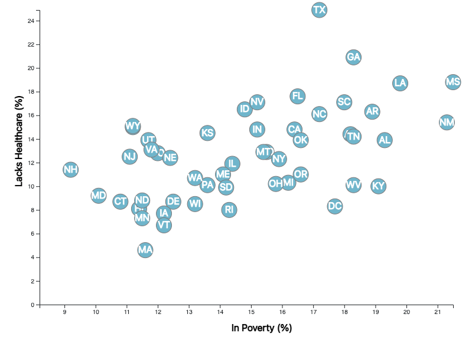
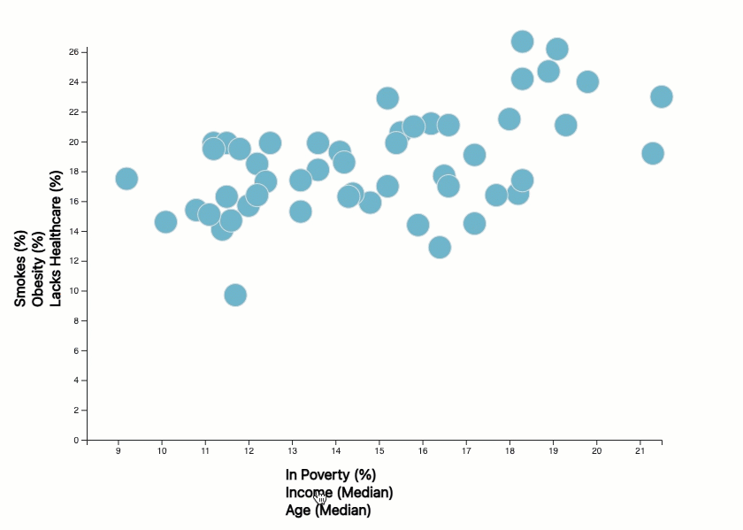

# D3-Challenge

## Background
With the provided data, analyze health risks facing particular demographics by creating charts, graphs, and interactive elements. The dataset used is from the U.S. Census Bureau is based on the 2014 ACS (American Community Survey) and includes data on rates of income, obesity, poverty, smoking, age, and lack of healthcare. 


## Technologies Used
* JavaScript
* D3
* HTML

## Objectives
1. Create a scatter plot between two data variables that represent each state with circle elements.

2. Bonus: Include more demographics by placing additional labels on the x and y axes. Animate the transitions for the circles' locations as well as the range of the axes.

### Static Scatter Plot

 

```javascript
d3.csv("assets/data/data.csv").then(data => {
    console.log(data);

    const y = d3.scaleLinear()
        .domain([0, d3.max(data.map(d => parseFloat(d.healthcare)))])
        .range([chartHeight, 0]);

    const x = d3.scaleLinear()
        .domain([d3.min(data.map(d => parseFloat(d.poverty))) + - 1, d3.max(data.map(d => parseFloat(d.poverty)))])
        .range([0, chartWidth]);

    const yAxis = d3.axisLeft(y);
    const xAxis = d3.axisBottom(x);

    chartG.append("g")
        .call(yAxis);

    chartG.append("g")
        .attr("transform", `translate(0, ${chartHeight})`)
        .call(xAxis);

    const xLabelArea = svg.append("g")
        .attr("transform", `translate(${svgWidth - 425}, ${svgHeight - margin.bottom + 45})`);

    xLabelArea.append("text")
        .attr("stroke", "#000000")
        .text("In Poverty (%)");

    const yLabelArea = svg.append("g")
        .attr("transform", `translate(${svgWidth - margin.left - 730}, ${svgHeight - 250})`);

    yLabelArea.append("text")
        .attr("transform", "rotate(-90)")
        .attr("stroke", "#000000")
        .text("Lacks Healthcare (%)");

    plotArea = chartG.append("g")
        .classed("plot-area", true)

    circleG = plotArea.selectAll("g")
        .data(data)
        .enter()
        .append("g")
        .attr("transform", d => `translate(${x(parseFloat(d.poverty))}, ${y(parseFloat(d.healthcare))})`)

    circleG.append("circle")
        .classed("stateCircle", true)
        .attr("r", 13)
        .attr("stroke-width", 1)
        .attr("fill", "rgb(89, 124, 158)")

    circleG.append("text")
        .text(d => d.abbr)
        .attr("stroke", "rgb(255, 255, 255)")
        .attr("fill", "rgb(255, 255, 255)")
        .attr("dy", ".3em")
        .attr("text-anchor", "middle")
    });

```

### Bonus

 

* Note: While I was able to successfully achieve transitions between selections on the axes, I was unable to get the state abbreviations to display on the circles as they did in the first graph. This is something I'll return to when time permits. 
